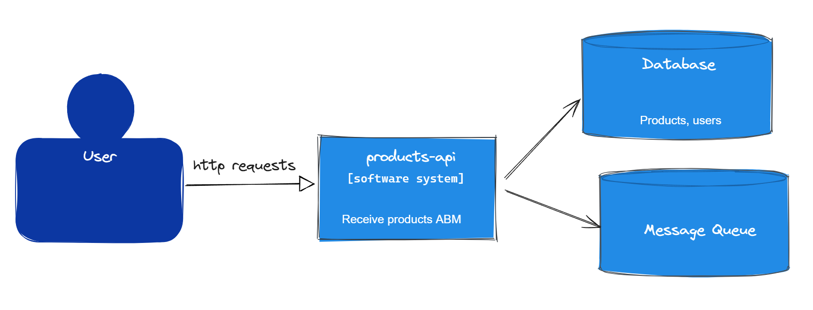
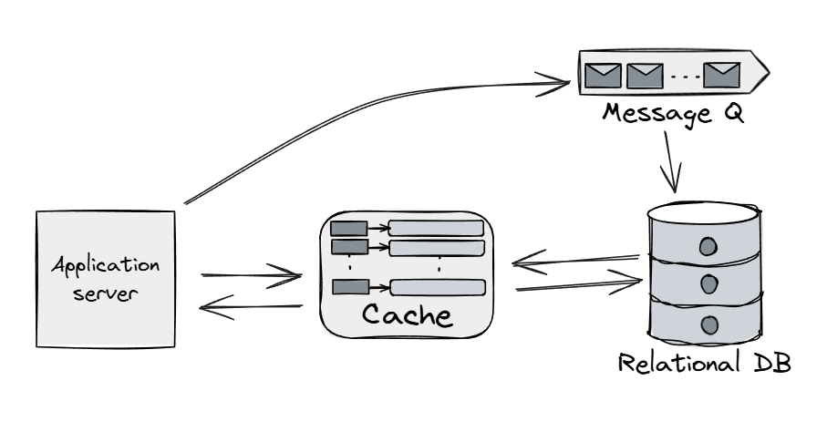
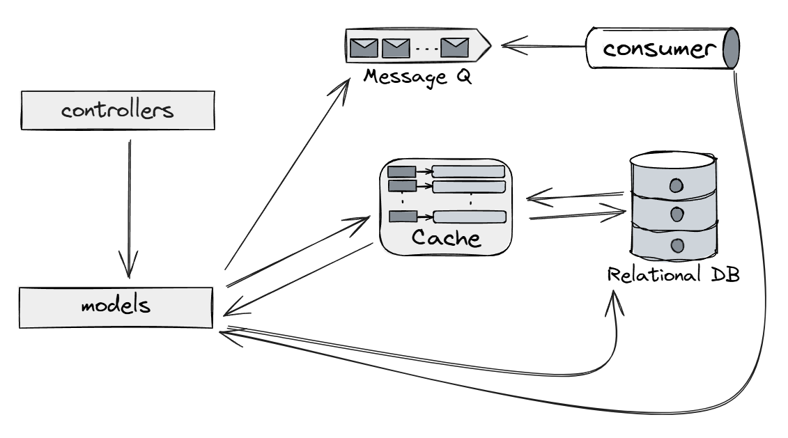

# Products API

### Contexto (System Context Diagram)



La api funciona se ocupa de recibir las peticiones de los usuarios para realizar un ABM de un producto. La api se ocupa 
de orquestar la persistencia de modo tal de garantizar que el producto se encuentre disponible de inmediato y que el mismo 
se persista de manera asincrona en la base de datos. También se ocupa de mantener la cache actualizada.

### Contenedores (Container Diagram)



**Servidor Web (Sinatra)**: Maneja las peticiones de la API.

**Base de Datos**: Almacena los productos.

**Memoria Caché**: Guarda productos temporalmente para consultas rápidas.

**Cola de Notificaciones**: Para procesar asincronicamente nuevas creaciones de productos.

### Diagrama de Componentes (Component Diagram)



El Servidor Web esta compuesto por:

**Controladores**(manejadores de rutas como /products y /products/:id). Se ocupa de recibir la petición y redirigirla
al modelo que corresponda. Tambien validan que el usuario que utiliza la api este previamente logueado.

**Modelos**(Producto y Usuarios). Gestiona los objetos en la base de datos.

**Caché** Es la que se ocupa de la información "caliente". Ya sea la generada a partir de un alta o la obtenida a partir
de una actualización. Esta brinda una respuesta mas rapida ante consultas frecuentes.

**Consumidor**. Se ocupa de leer las novedades que se generan a partir del ABM de operaciones y actua en concecuencia
actualizando la Base de Datos "fria".

**Base de datos**. Es donde se persisten los registros a largo plazo. 

## ¿Comó levantar la api?

Prerequisitos:

- Tener Docker instalado

Ejecutar el siguiente comando en una terminal

```sh
docker-compose up --build
```
Una vez los contenedores esten levantados realizar las consultas en 

```
http://localhost:4567/
```

