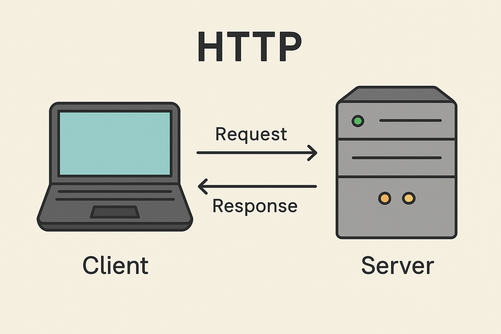

# ¿Qué es un HTTP?
**HTTP** (Hypertext Transfer Protocol) es un protocolo de comunicación utilizado en la red para transferir información entre servidores y clientes (navegadores). Funciona mediante solicitudes y respuestas, permitiendo la carga de páginas, imágenes y otros recursos. Es la base de Internet y puede usar cifrado (HTTPS) para mayor seguridad.
